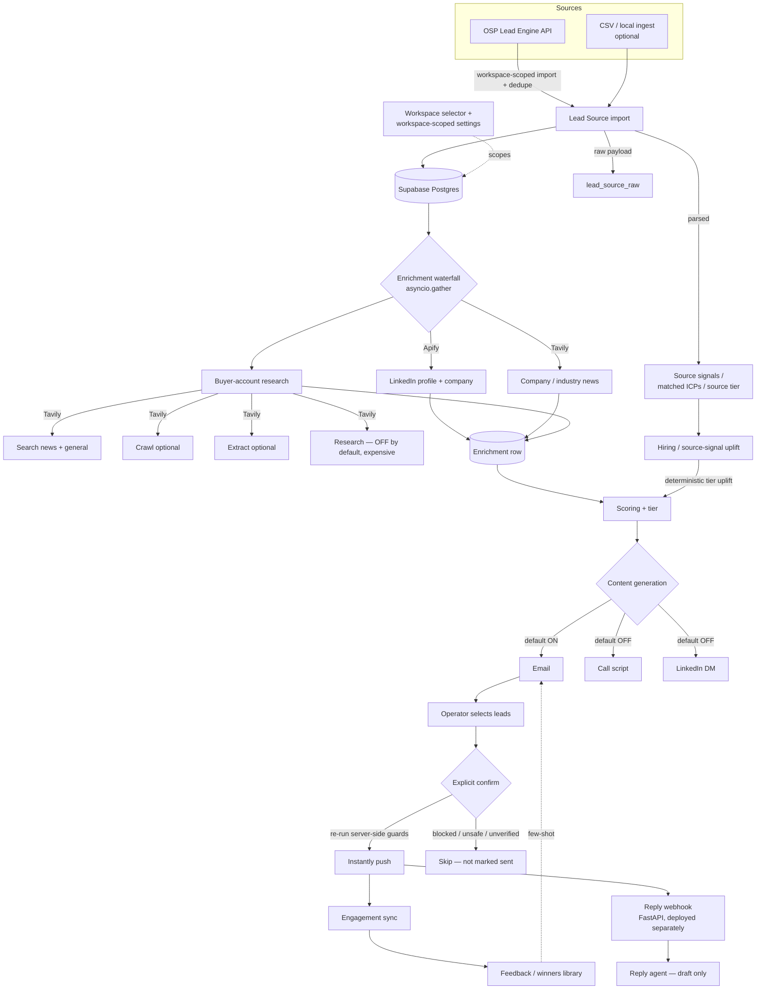

# OSP GTM Enrichment

A multi-workspace GTM enrichment and outbound operations platform. It pulls
leads from the **OSP Lead Engine API**, imports and dedupes them per workspace,
preserves the raw source payload and any imported signals, then runs enrichment,
buyer-account research, Tavily company research, hiring/source-signal
enrichment, scoring, and email generation. Approved, eligible leads are pushed
to **Instantly only after an explicit operator confirmation**, and engagement /
reply data is pulled back to feed the feedback loops. Imports can run
continuously (evergreen) through an external scheduler such as Render Cron.

Built as a production-style GTM enrichment and outbound workflow system. The
operator UI is a Streamlit multipage app; production data lives in **Supabase
Postgres** (SQLAlchemy ORM).

---

## What it does

- **Multi-workspace** — every setting, prompt, lead, signal, and config is
  scoped to a workspace. Workspaces are isolated from each other.
- **Lead sourcing** — imports contacts from the OSP Lead Engine API per
  workspace, dedupes them, stores the full source payload (`lead_source_raw`),
  and parses source signals / matched ICPs / source tier when present.
- **Enrichment waterfall** — LinkedIn profile + company details (Apify actors)
  and company/industry news (Tavily) run concurrently per lead; a single source
  failure never blocks the lead.
- **Buyer-account research** — Tavily Search (news + general), Crawl, and
  Extract over a configurable news window (default 90 days), relevance-first.
  The expensive Tavily **Research** agent exists but is **off by default**.
- **Signal enrichment** — hiring-signal rescue and imported source signals can
  deterministically uplift a lead's tier before scoring.
- **Scoring** — Claude (Opus by default) scores each lead into a tier with a
  rationale and cited signals.
- **Content generation** — **email is on by default**; call scripts and
  LinkedIn DMs are **off by default** to control LLM cost (workspace toggles).
- **Safety-gated delivery** — leads are never pushed automatically. The operator
  selects leads and explicitly confirms; the push re-runs every server-side
  safety check.
- **Feedback loops** — engagement sync, a draft-only reply agent, and a
  self-improving winners library.

---

## Architecture



Every external call (Apify / Tavily / Instantly / OSP Lead Engine) is wrapped
with a `tenacity` retry (transient-only). Enrichment sources run concurrently
per lead via `asyncio.gather(return_exceptions=True)`, and per-source
success/error/duration is persisted on the `Enrichment` row's `source_status`
JSON.

---

## Setup

```bash
# 1. Install
pip install -r requirements.txt          # core
pip install -r requirements-ui.txt        # Streamlit UI

# 2. Configure
cp .env.example .env                       # then edit (see below)

# 3. Initialize the schema
python scripts/init_db.py

# 4. Run the operator UI
streamlit run app/main.py
```

### Environment variables

| Variable                    | Required when…                              | Purpose                                                            |
| --------------------------- | ------------------------------------------- | ------------------------------------------------------------------ |
| `DATABASE_URL`              | always (prod)                               | Supabase Postgres connection string (`postgresql://…`).            |
| `ANTHROPIC_API_KEY`         | always                                      | Scoring (Opus) + content (Sonnet).                                 |
| `TAVILY_API_KEY`            | always                                      | Company news + buyer-account research (Search/Crawl/Extract).      |
| `APIFY_API_TOKEN`           | LinkedIn/company enrichment                 | Apify actors used by the enrichment waterfall.                     |
| `INSTANTLY_API_KEY`         | pushing to Instantly                        | Email delivery + engagement sync.                                  |
| `INSTANTLY_CAMPAIGN_ID`     | pushing (unless set per workspace)          | Default campaign; workspaces can override in-app.                  |
| `INSTANTLY_WEBHOOK_SECRET`  | reply webhook                               | Validates inbound Instantly reply webhooks.                        |
| `LEAD_SOURCE_JOB_SECRET`    | scheduled-import HTTP endpoint              | Authorizes `POST /api/lead-source/run-scheduled`.                  |

> **OSP Lead Engine credentials** (API base URL, client slug, API key) are
> **configured per workspace in the app** (Settings → Lead Sources), not via
> environment variables.

`DATABASE_URL` defaults to a local `sqlite:///sdr.db` if unset. **SQLite is a
local/dev/test convenience only — production uses Supabase Postgres.** The same
`DATABASE_URL` is shared by the Streamlit app, the webhook server, and the
scheduler so they all read/write the same database.

> ⚠️ **Instantly campaign template setup** — before any live send, your
> campaign sequence template MUST reference `{{personalized_subject}}` and
> `{{personalized_body}}` placeholders (not hardcoded subject/body), or the
> generated copy won't appear in delivered emails.

### Deployment notes

- **Streamlit app** — runs on Streamlit Cloud (or any host); reads
  `DATABASE_URL` for Supabase Postgres.
- **Reply webhook** — a separate FastAPI service (`run_webhook.py` /
  `uvicorn src.webhook.server:app`). Streamlit Cloud runs only the Streamlit
  process, so deploy the webhook separately (e.g., a Render Web Service) using
  the same `DATABASE_URL`.
- **Evergreen imports** — run `python -m src.lead_source.scheduler` from an
  external scheduler (e.g., Render Cron), or hit the webhook server's
  `POST /api/lead-source/run-scheduled` endpoint on a schedule.

> The old `data/sample_leads.csv` + `scripts/ingest_leads.py` path still works
> for **local testing only**; production leads come from the OSP Lead Engine.

---

## OSP Lead Engine / Evergreen imports

Leads come from the **OSP Lead Engine API**. Each workspace stores its own Lead
Source settings (API base URL, client slug, API key, ICP / status filters,
fetch limit, auto-import toggles).

- Imports are **workspace-scoped**; dedupe prevents re-importing existing
  contacts.
- A **cursor/offset** is advanced after each scheduled run so successive runs
  don't keep pulling the same top contacts.
- The full `ContactOut` payload is stored in **`lead_source_raw`** for
  provenance.
- **Source signals / matched ICPs / source tier** are parsed into local signal
  rows when present.
- Email verification is mapped from the source payload when `email_verified` is
  true.
- Scheduled imports run **externally** (the app does not run background jobs).

Run one cycle for all enabled workspaces:

```bash
python -m src.lead_source.scheduler                 # all enabled workspaces
python -m src.lead_source.scheduler --workspace-id 3 --dry-run
```

Suggested cron schedules:

```cron
0 */6 * * *     # production — every 6 hours
*/5 * * * *     # testing — every 5 minutes
```

The scheduler never auto-sends email and never pushes to Instantly — it only
imports, enriches, scores, and (where enabled) generates content.

---

## Buyer research & Tavily

Buyer-account research (`src/enrichment/buyer_accounts.py`) layers several Tavily
modes to build company context and find the strongest outreach signal:

- **Search** — windowed `news` topic + a general signal query (both always run).
- **Crawl** — the company website, when a domain is known and crawl is enabled.
- **Extract** — the top source URLs, when extract is enabled.
- **Research** — Tavily's research agent. It exists but is **off by default**
  because `/research` is expensive; enable it per workspace only when needed.

Behavior:

- Configurable **news window** (default **90 days**); **relevance is prioritized
  over recency**.
- Crawl / Extract / Research are independent workspace toggles for cost control.
- Lead Detail surfaces the research metadata, the selected signal, and clear
  no-signal / skipped-because-disabled states (it never re-runs Tavily on page
  load).

---

## Content generation

Content is generated per workspace, gated by cost-control toggles:

| Type           | Default | Notes                                              |
| -------------- | ------- | -------------------------------------------------- |
| Email          | **on**  | `generate_email_enabled`                           |
| Call script    | off     | `generate_call_script_enabled`                     |
| LinkedIn DM    | off     | `generate_linkedin_dm_enabled`                     |

When a type is disabled, **new** generation is skipped, but any previously saved
call-script / LinkedIn content still displays in the UI.

---

## Instantly push safety

Leads are **never pushed automatically**. The operator selects leads on the
Leads page and explicitly confirms the push. On confirm, the push re-runs the
full server-side eligibility/safety filter (`filter_eligible` + the bulk-push
flow) so the same guards apply no matter where the request originates. It
blocks:

- **Unsafe internal content** — e.g. buyer-research `NEEDS REVIEW:` placeholders
  and other internal-only markers (`is_unsafe_internal_content`).
- **Missing / empty content** — no email-kind content with a body.
- **Unverified emails** — when a verifier is configured and status isn't valid.
- **Below-tier / already-sent / in-progress** leads.

Blocked or failed leads are **not** marked as sent, and only the still-eligible
subset of the selection is pushed.

---

## Instantly reply webhook / reply agent

A FastAPI webhook (`src/webhook/`) receives Instantly **Lead Replied** events at
`POST /api/instantly/reply-webhook`, validated against
`INSTANTLY_WEBHOOK_SECRET`. It is deployed separately from the Streamlit app
(see Deployment notes) and shares the same `DATABASE_URL`.

Inbound replies are classified and routed to a **draft-only** reply flow
(`src/feedback/reply_agent.py`): it produces a suggested draft and human-review
notes for the operator. It does **not** auto-send, create Gmail drafts, or book
meetings — sending stays a human decision.

---

## Other entry points

| Command                                         | What it does                                            |
| ----------------------------------------------- | ------------------------------------------------------- |
| `streamlit run app/main.py`                     | Operator UI (workspaces, leads, settings, push)         |
| `python -m src.lead_source.scheduler`           | One evergreen import/enrich/score/content cycle         |
| `python run_webhook.py`                         | Reply webhook server (dev)                              |
| `python scripts/run_pipeline.py`                | Run the pipeline on all leads (dry-run by default)      |
| `python scripts/pull_engagement.py`             | Sync engagement + promote new winners                   |
| `python scripts/report.py`                      | Print pipeline metrics                                  |
| `python scripts/migrate_to_production.py`       | Copy local SQLite data into Supabase Postgres           |
| `pytest tests/`                                 | Run the test suite                                      |

---

## Design decisions

**Supabase Postgres + SQLAlchemy** — Production data is stored in Supabase
Postgres. SQLAlchemy keeps the app database-agnostic and gives us consistent
models, relationships, and runtime migrations. SQLite can still be used locally
for lightweight testing, but production uses Supabase Postgres.

**Workspace isolation** — Leads, settings, prompts, signals, and Instantly
routing are scoped to a workspace; one workspace's data and config never leak
into another.

**Source-payload preservation** — The full OSP Lead Engine `ContactOut` JSON is
stored on the lead (`lead_source_raw`) so nothing is lost and signals can be
re-parsed later.

**Signal-first ingestion** — Imported source signals and hiring signals are
parsed into local rows and can deterministically uplift a lead's tier before
scoring, so strong intent isn't lost.

**Safety-gated Instantly push** — Pushing is explicit and re-validates every
guard server-side; internal/placeholder content and unverified emails can never
reach a prospect, and blocked leads are never marked sent.

**Cost-controlled generation** — Email is on by default; call scripts and
LinkedIn DMs are off by default; the expensive Tavily Research agent is off by
default. Each is a workspace toggle.

**Tavily research with Search/Crawl/Extract (+ optional Research)** — Layered,
relevance-first company research over a configurable window, with cheaper modes
on by default and the costly research agent opt-in.

**Fail-graceful enrichment** — `asyncio.gather(return_exceptions=True)` plus
per-source try/except means one provider failure never tanks a lead; outcomes
are recorded on `source_status`.

**Pydantic for every LLM I/O** — Schemas reject malformed JSON before it's
persisted, catching LLM regressions instead of storing garbage.

**Prompt/version tracking** — `prompt_version` is stored on every
`GeneratedContent` row so quality can be re-evaluated against historical
engagement. Prompts live in `src/prompts/`.

**Dry-run / explicit-confirmation by default** — Pipeline scripts default to
dry-run and the UI push requires explicit confirmation, so it's hard to ship
test data by accident.

---

## What I'd change at scale

1. **Alembic migrations** — formalize schema evolution (the app currently uses
   SQLAlchemy with runtime DDL helpers).
2. **Job queue (Celery / Dramatiq)** — bounded, rate-limit-aware concurrency for
   high-volume enrichment instead of sequential per-lead loops.
3. **Tavily crawl/extract caching by domain** — avoid re-crawling the same
   company across leads/workspaces.
4. **Provider cost dashboard** — surface Anthropic / Tavily / Apify / Instantly
   spend and cache-hit rates.
5. **Per-workspace spend limits** — hard budget caps per workspace.
6. **Rate-limit-aware scheduler** — per-provider backoff and circuit breakers.
7. **Webhook-first engagement sync** — reduce polling latency and wasted calls.
8. **Stronger source-signal schema contracts** with OSP Lead Engine — validated,
   versioned payloads instead of best-effort parsing.
9. **PII retention/deletion workflows** — DPA review, encryption at rest, and a
   deletion endpoint for real prospect data.

---

## Repository layout

```
OSP-GTM-Enrichment/
├── README.md, requirements.txt, requirements-ui.txt, pyproject.toml
├── run_webhook.py                  # Reply webhook entry point
├── app/
│   ├── main.py
│   ├── pages/                      # Streamlit pages: dashboard, leads, lead
│   │                               #   detail, run pipeline, engagement,
│   │                               #   settings, prompts, lead sources
│   └── lib/                        # UI helpers: workspace_state, bulk_push,
│                                   #   push_confirm, research_display, runners…
├── src/
│   ├── config.py, icp_config.py    # Settings + per-workspace ICP/config
│   ├── db.py, models.py            # SQLAlchemy (Supabase Postgres / SQLite)
│   ├── workspace.py                # Workspace creation + isolation
│   ├── lead_source/                # OSP Lead Engine client, ingest, mapper,
│   │                               #   source signals, evergreen scheduler
│   ├── signals/                    # Hiring + source-signal uplift, store
│   ├── enrichment/                 # Waterfall, buyer research, Apify, news
│   ├── content/                    # Email, call script, LinkedIn DM, winners
│   ├── delivery/                   # Eligibility guards, Instantly, verify email
│   ├── webhook/                    # FastAPI reply webhook (handler + server)
│   ├── prompts/                    # Version-tagged prompt templates
│   ├── feedback/                   # Engagement sync, reply agent, learning
│   ├── scoring.py, context.py      # Scoring + prompt context assembly
│   └── pipeline.py                 # Orchestrator
├── scripts/                        # init_db, scheduler/migration/reporting CLIs
└── tests/                          # See below
```

Tests cover import, workspace isolation, enrichment, scoring, content safety,
Instantly push guards, Tavily research, and scheduler behavior.
