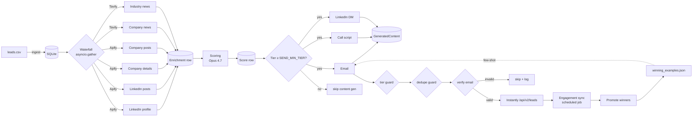

# SDR Enablement Pipeline

End-to-end outbound prospecting automation. Takes a CSV of leads → enriches each
one across LinkedIn + news → scores with Claude Opus 4.7 → generates a personalized
email + cold call script + LinkedIn DM with Sonnet 4.6 → delivers via Instantly →
pulls engagement data back to feed a self-improving few-shot library.

Built as a take-home for an SDR enablement role.

---

## Architecture



Every Apify / Tavily / Instantly call is wrapped with a `tenacity` retry decorator
(3 attempts, exp backoff, transient-only). Every enrichment source runs concurrently
per lead via `asyncio.gather(return_exceptions=True)` — a single source failure
never blocks the pipeline. Per-source success/error/duration is persisted on the
`Enrichment` row's `source_status` JSON for observability.

---

## Setup (5 minutes)

```bash
# 1. Install
pip install -r requirements.txt

# 2. Configure
cp .env.example .env
# Edit .env and fill in: ANTHROPIC_API_KEY, APIFY_API_TOKEN, TAVILY_API_KEY,
# INSTANTLY_API_KEY, INSTANTLY_CAMPAIGN_ID

# 3. Initialize DB + ingest sample leads
python scripts/init_db.py
python scripts/ingest_leads.py data/sample_leads.csv

# 4. Run the demo (always dry-run — no Instantly POST)
python scripts/demo.py
```

That's it. The demo iterates 8 sample leads with live Rich CLI output showing
enrichment, scoring, generated content, and the delivery decision per lead.

> ⚠️ **Instantly campaign template setup** — before any live send, your
> campaign sequence template MUST reference `{{personalized_subject}}` and
> `{{personalized_body}}` placeholders (not hardcoded subject/body). Without
> these placeholders, the generated copy will not appear in delivered
> emails — Instantly falls back to whatever literal text the template
> contains. After wiring the template, verify end-to-end with
> `python scripts/instantly_push_one.py <lead_id>` — it sends one lead and
> diffs the read-back custom_variables against the local DB.

### Required accounts

| Service     | Used for                                       | Where to get a key                  |
| ----------- | ---------------------------------------------- | ----------------------------------- |
| Anthropic   | Lead scoring (Opus 4.7), content (Sonnet 4.6)  | console.anthropic.com               |
| Apify       | LinkedIn enrichment (4 actors)                 | apify.com                           |
| Tavily      | Company + industry news                        | tavily.com                          |
| Instantly   | Email delivery + engagement                    | instantly.ai                        |
| Verifier    | Email verification (Instantly default; or NB / MV) | (see EMAIL_VERIFIER in .env)    |

---

## Demo walkthrough

`python scripts/demo.py` runs the full pipeline on every lead in the DB. For each
lead you'll see:

1. **Enrichment fan-out** — six sources, marked `+` / `x` per source with timing.
   Failures are non-fatal; the pipeline records the error and continues.
2. **Score** — number, tier, rationale, and the specific signals the model used.
3. **Generated email** — with subject, body, and signals cited. (Skipped if the
   tier is below `SEND_MIN_TIER` — saves Sonnet tokens at scale.)
4. **Cold call script** — opener, value prop, 3 objection/response pairs, close.
5. **LinkedIn DM** — short connection-note variant.
6. **Delivery decision** — dry-run by default. Pre-send guards run in this order:
   tier threshold → dedupe → email verification → send.

A summary table prints at the end. Structured JSON logs land in
`logs/sdr_run_<YYYY-MM-DD>.log` for any post-hoc debugging.

### Other entry points

| Command                                         | What it does                                            |
| ----------------------------------------------- | ------------------------------------------------------- |
| `python scripts/run_pipeline.py`                | Run full pipeline on all leads (dry-run by default)     |
| `python scripts/run_pipeline.py --live`         | Same, but actually POSTs to Instantly                   |
| `python scripts/pull_engagement.py`             | Sync engagement from Instantly + promote new winners    |
| `python scripts/report.py`                      | Print pipeline metrics (tiers, send/reply rates, skips) |
| `pytest tests/`                                 | Run the 21 unit tests                                   |

### Scheduling the engagement sync (Windows)

```powershell
# Run pull_engagement.py daily at 7am via Task Scheduler
schtasks /Create /TN "SDR Engagement Sync" /TR "python C:\path\to\scripts\pull_engagement.py" /SC DAILY /ST 07:00
```

On Linux/macOS:
```cron
0 7 * * * cd /path/to/sdr && /usr/bin/python scripts/pull_engagement.py
```

---

## Design decisions

**SQLite + SQLAlchemy** — One config-line migration to Postgres. SQLite is enough
for take-home scale; the ORM keeps us honest about field types and relationships.

**Pydantic for every LLM I/O** — Schemas reject malformed JSON before it gets
persisted. Catches LLM regressions early instead of silently storing garbage.

**Prompts as version-tagged Python strings** — `prompt_version` is stored on
every `GeneratedContent` row. When a prompt changes, you can re-score quality
against historical engagement. Prompts live in `src/prompts/`.

**Fail-graceful waterfall** — `asyncio.gather(return_exceptions=True)` plus a
per-source try/except means one Apify rate-limit event never tanks a lead. Every
source's outcome is recorded on the `Enrichment` row's `source_status` JSON.

**Tenacity retries on the right axis** — 3 attempts, exponential backoff, but
**only on transient errors** (network, 5xx, timeouts). 4xx auth/validation errors
fail fast — retrying them just burns time and quota.

**Email verification before send, with caching** — Verification result lives on
the `Lead` row. Re-running the pipeline on the same lead doesn't re-charge the
verifier. Skip-on-invalid is on by default; skip-on-risky is opt-in via
`strict_verification` to give the user a knob to protect sender reputation.

**Single source of truth for tier thresholds** — `Settings.tier_for_score()` is
the only place tiers are decided. The LLM may suggest a tier, but it's reconciled
against config. Change the threshold in `.env`, re-score, done.

**Tier-gated content generation** — Tier-C leads don't burn Sonnet tokens on
content the pipeline will refuse to send. Saves money at scale.

**Self-improving few-shot library** — `winning_examples.json` is loaded into the
email prompt's system block (with prompt caching so it's not re-billed every
call). New winners are auto-promoted from replied emails by `pull_engagement.py`.
Manually-flagged seeds always rank above auto-promoted entries.

**Dry-run by default** — The default for `run_pipeline.py` is dry-run. You have
to pass `--live` to actually deliver. Hard to accidentally ship test data this
way.

---

## What I'd change at scale

1. **Postgres + Alembic** — SQLite is fine until concurrent writers. The schema
   is already SQLAlchemy 2.0; switching is one `DATABASE_URL`.
2. **Job queue (Celery or Dramatiq) instead of sequential lead loop** — Right now
   leads are processed one at a time. At 10k leads/day, you want bounded
   concurrency with rate-limit-aware backoff per provider.
3. **Per-Apify-actor rate limiter + circuit breaker** — Apify actors have wildly
   different cost/throughput. Today retries stop after 3; a circuit breaker that
   short-circuits a provider after N consecutive failures saves the next 50
   leads from waiting.
4. **Prompt caching telemetry** — The cached system prompts should hit Anthropic's
   cache after the first call. Today we don't surface cache hit rate; I'd add
   that to the structured log payload.
5. **Cohort-based reply-rate, not per-lead** — Today `learning.py` treats reply
   as binary at the lead grain. With more volume I'd group emails by template
   fingerprint and promote based on cohort reply rate (with a Beta-Binomial
   confidence interval) so we don't promote a lucky one-off.
6. **Webhook ingestion for Instantly events** — Polling is fine for the demo;
   webhooks remove the polling delay and the wasted API calls.
7. **PII handling** — Sample leads are fictional. Real deployment needs DPA
   review, encryption at rest, and a deletion endpoint.

---

## Next iterations (deliberately deferred)

- **Hiring-intent enrichment via `harvestapi/linkedin-job-search`** — open roles
  are a strong intent signal (what they're investing in, what teams are growing).
  Cut from v1 to keep demo setup friction low; one extra Apify actor.
- **Multi-campaign routing** — Tier A → high-touch campaign, Tier B → standard.
  Today single-campaign via `INSTANTLY_CAMPAIGN_ID`.
- **A/B testing on prompt versions** — `prompt_version` is already persisted;
  the analytics query to break out reply rate by version is straightforward.
- **A "negative examples" library** — Right now we few-shot only winners. Adding
  the worst-performing emails as negative examples ("don't write like this") is
  a known performance lift.
- **Sender warm-up integration** — Pre-flight check that the sending account is
  warm enough for the day's send volume.

---

## Repository layout

```
sdr-enablement/
├── README.md, .env.example, requirements.txt, pyproject.toml
├── data/
│   ├── sample_leads.csv          # 8 fictional B2B leads
│   └── winning_examples.json     # Few-shot library, auto-updated
├── src/
│   ├── config.py                 # Settings class — single source of truth
│   ├── db.py, models.py          # SQLAlchemy 2.0
│   ├── retry.py                  # Tenacity decorator (transient-only)
│   ├── logging_setup.py          # JSON file + Rich console
│   ├── llm.py                    # Anthropic client + JSON-schema enforcer
│   ├── context.py                # Lead+enrichment+score -> markdown for prompts
│   ├── enrichment/               # 4 Apify modules + Tavily news + waterfall
│   ├── scoring.py                # Opus 4.7
│   ├── content/                  # Email, call script, LinkedIn DM (Sonnet 4.6)
│   ├── prompts/                  # Version-tagged prompt templates
│   ├── delivery/                 # Email verify + Instantly send w/ pre-send guards
│   ├── feedback/                 # Engagement sync + winner promotion
│   └── pipeline.py               # Orchestrator
├── scripts/                      # init_db, ingest, run_pipeline, pull_engagement, demo, report
└── tests/                        # 21 tests, in-memory SQLite, mocked Apify
```
